# Metrics that Matter in Production

To optimize performance, you must first measure it. When running Walrus components (Publisher/Aggregator) in production, you should monitor specific metrics to identify bottlenecks.

## Prometheus Metrics Endpoint

Walrus services expose a `/metrics` endpoint compatible with Prometheus by default.

```bash
# Default metrics endpoint
curl http://127.0.0.1:27182/metrics

# Configure with --metrics-address
walrus aggregator --bind-address "0.0.0.0:31415" --metrics-address "0.0.0.0:27182"
```


## Key Metrics Categories

### 1. Throughput & Latency

| Metric | Description | What to Watch |
|:-------|:------------|:--------------|
| **End-to-End Latency** | Time from request start to response | High latency = network issues or slow nodes |
| **Time to First Byte (TTFB)** | Time until aggregator starts sending data | Critical for perceived performance |
| **Requests per Second** | Upload/download throughput | Capacity planning |

**Example Prometheus Query:**
```promql
# p95 latency for blob reads
histogram_quantile(0.95, rate(walrus_read_duration_seconds_bucket[5m]))
```

### 2. Encoding / Decoding Performance

| Metric | Description | What to Watch |
|:-------|:------------|:--------------|
| **Encoding Duration** | Time spent calculating erasure codes | Spike = CPU bottleneck |
| **Decoding Duration** | Time spent reconstructing blobs | Affected by sliver availability |
| **Sliver Distribution** | Slivers sent successfully vs. failed | Failed slivers increase retry time |

**Performance Correlation:**

```mermaid
flowchart TD
    A[Encoding Duration ↑] --> B{Cause?}
    B -->|CPU| C[Scale up CPU<br/>or reduce concurrency]
    B -->|Memory| D[Increase RAM<br/>or reduce blob size]
    B -->|Contention| E[Check other processes<br/>on the host]
```


### 3. Reliability Metrics

| Metric | Description | What to Watch |
|:-------|:------------|:--------------|
| **Storage Node Availability** | % of nodes responding successfully | < 67% = degraded performance |
| **Retry Rate** | Retries per request | High rate kills latency |
| **Error Rate** | Failed requests / total requests | Target < 1% |

**Why Retry Rate Matters:**
```
Request without retries: 100ms
Request with 2 retries:  100ms + 200ms (backoff) + 400ms (backoff) = 700ms
```

High retry rates drastically increase perceived latency even if eventual success rate is high.

### 4. Resource Usage

| Metric | Description | What to Watch |
|:-------|:------------|:--------------|
| **Memory Usage** | Heap/RSS of publisher/aggregator | Watch for OOM kills |
| **Network I/O** | Bytes in/out per second | Bandwidth saturation |
| **File Descriptors** | Open connections | Exhaustion causes failures |
| **CPU Usage** | Encoding is CPU-intensive | Sustained > 80% = bottleneck |

## Alerting Thresholds

| Metric | Warning | Critical | Possible Cause |
|:-------|:-------:|:--------:|:---------------|
| **Success Rate** | < 99% | < 95% | Network partition, bad nodes |
| **p95 Latency** | > 2s (small blobs) | > 5s | Congestion, CPU starvation |
| **Active Connections** | 80% of limit | 95% of limit | Connection leak, high load |
| **Memory Usage** | > 70% | > 85% | Memory leak, large blobs |
| **Retry Rate** | > 10% | > 25% | Node failures, rate limiting |

## Grafana Dashboard Setup

> 📚 **Reference:** A local Grafana/Prometheus setup is available at [`docker/grafana-local/`](https://github.com/MystenLabs/walrus/tree/main/docker/grafana-local) for development.

**Recommended Dashboard Panels with PromQL Queries:**

| Panel | PromQL Query | Visualization |
|:------|:-------------|:--------------|
| **Upload Throughput** | `rate(walrus_blob_upload_bytes_total[5m])` | Graph (bytes/sec) |
| **Read Throughput** | `rate(walrus_blob_read_bytes_total[5m])` | Graph (bytes/sec) |
| **Success Rate** | `sum(rate(walrus_requests_total{status="success"}[5m])) / sum(rate(walrus_requests_total[5m])) * 100` | Stat (percentage) |
| **p95 Latency** | `histogram_quantile(0.95, rate(walrus_request_duration_seconds_bucket[5m]))` | Heatmap or Graph |
| **Retry Rate** | `rate(walrus_retries_total[5m]) / rate(walrus_requests_total[5m]) * 100` | Stat (percentage) |
| **Error Rate by Type** | `sum by (error_type) (rate(walrus_errors_total[5m]))` | Pie chart or Table |

> ⚠️ **Note:** The exact metric names may vary. Run `curl http://127.0.0.1:27182/metrics` to see available metrics from your Walrus services.

**Conceptual Dashboard Layout:**

```
┌─────────────────────────────────────────────────────────────┐
│  Walrus Performance Dashboard                               │
├─────────────────────┬─────────────────────┬─────────────────┤
│  Upload Throughput  │  Read Throughput    │  Success Rate   │
│  (Graph: bytes/sec) │  (Graph: bytes/sec) │  (Stat: 99.5%)  │
├─────────────────────┴─────────────────────┴─────────────────┤
│  p95 Latency (Heatmap - shows distribution over time)       │
├─────────────────────────────────────────────────────────────┤
│  Retry Rate (Stat)  │  Error Rate by Type (Pie/Table)       │
└─────────────────────────────────────────────────────────────┘
```

**Key Dashboard Design Principles:**
1. **Throughput side-by-side** - Compare upload vs. read rates
2. **Use Heatmaps for latency** - Averages hide problems; distributions reveal them
3. **Group by error type** - Distinguish transient (retry-able) vs. permanent errors
4. **Add annotations** - Mark deployments, config changes to correlate with metric changes

## Debugging Common Issues

### High Latency, Normal Success Rate


### Decreasing Throughput Over Time
1. **Check memory usage** - Memory leak causing GC pressure?
2. **Check connection count** - Connection pool exhausted?
3. **Check disk I/O** - Cache disk full?

## Key Takeaways

- **Prometheus integration**: Services expose `/metrics` endpoint on port 27182 (configurable via `--metrics-address`)
- **Four metric categories**: Latency/throughput, encoding performance, reliability metrics, and resource usage
- **Retry rate impact**: High retry rates kill latency even with good eventual success rate
- **Proactive alerting**: Set thresholds (e.g., success rate < 99% warning, < 95% critical) before users report issues
- **Metric correlation**: Latency spike + CPU spike typically indicates encoding bottleneck
- **Dashboard visualization**: Use Grafana to display throughput and error rate side-by-side for quick diagnosis

## Next Steps

Now that you understand monitoring, proceed to the [Hands-On Lab](./07-hands-on.md) to measure performance improvements yourself by comparing sequential vs. parallel uploads.
