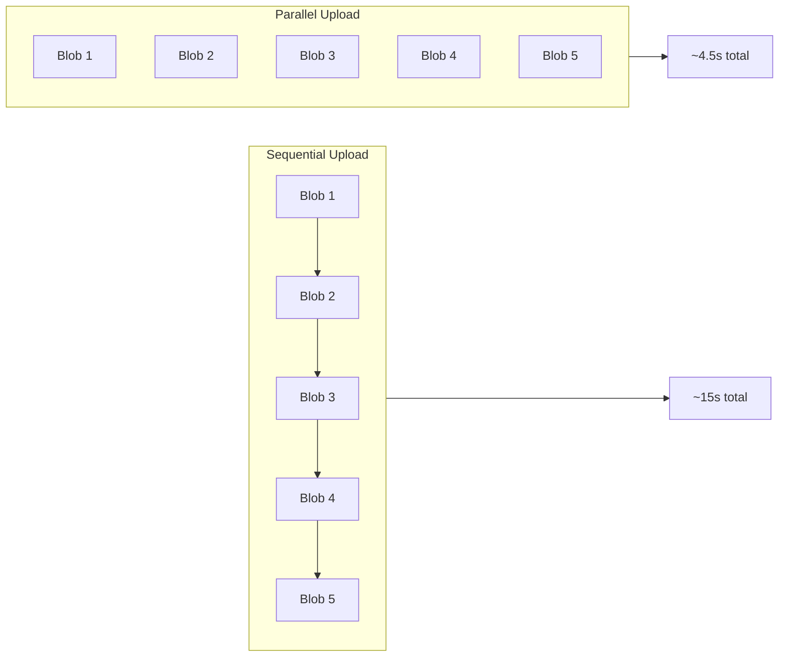

# Hands-on Lab: Tune Upload Parameters

In this lab, you will empirically measure the impact of parallel processing on Walrus upload performance. You will run a script that uploads data sequentially and then in parallel, calculating the throughput improvement.

## Learning Objectives

By completing this lab, you will:

- Measure the difference between sequential and parallel uploads
- Calculate throughput in MB/s
- Understand the relationship between latency and throughput
- Identify bottlenecks in upload performance
- Experience the two levels of parallelism: inter-blob (your code) and intra-blob (SDK handles)

## Prerequisites

- ✅ Node.js 18+ installed (or Docker)
- ✅ A terminal with internet access (to reach Sui Testnet and Walrus nodes)
- ✅ A funded Testnet wallet with SUI tokens (script can request from faucet)

## Running in Docker (Recommended)

For a consistent environment across all operating systems, use the Docker setup:

```bash
# From the performance_optimization module directory
cd docker
make build
PASSPHRASE='your testnet passphrase' make run

# Interactive shell for exploration
make shell
```

> 💡 **Docker Benefits:**
> - Identical Node.js version across all systems
> - Pre-installed dependencies
> - Consistent test results

## Local Setup (Alternative)

If you prefer running locally without Docker:

1. Navigate to the hands-on directory:

```bash
cd docs/book/curriculum/performance_optimization/hands-on-source-code
```

2. Install dependencies:

```bash
npm install
```

3. Set your wallet passphrase:

```bash
export PASSPHRASE='your testnet passphrase'
```

## The Experiment

The script `ts/throughput-tuner.ts` performs:

1. **Generate**: Creates random data blobs (1MB each)
2. **Sequential Upload**: Uploads blobs one by one
3. **Parallel Upload**: Uploads all blobs concurrently
4. **Report**: Calculates and compares throughput (MB/s)



## Run the Script

**Docker (Recommended):**

```bash
PASSPHRASE='your testnet passphrase' make run
```

**Local:**

```bash
npm start
```

> **Note:** The script will automatically request testnet SUI tokens from the faucet if needed. This might take a few seconds.

## Expected Output

You should see output similar to this (times vary significantly by network):

```text
=== Walrus Performance Tuning Lab ===
Comparing sequential vs concurrent upload patterns

Using default passphrase (set PASSPHRASE environment variable to use your own)
Using wallet address: 0x98cd680f8332b94446f16ad992f1d5ef220e601542a1997d61dea562f5654b4d
Wallet already has 102.377908595 SUI
Current WAL balance: 0.86569 WAL
✅ Sufficient WAL balance available
Generating 5 blobs of 1024 KB each...

--- Scenario A: Sequential Uploads ---
Uploading one blob at a time, waiting for each to complete...

Uploading blob 1/5... Done.
Uploading blob 2/5... Done.
Uploading blob 3/5... Done.
Uploading blob 4/5... Done.
Uploading blob 5/5... Done.

Sequential Results:
  Successful uploads: 5/5
  Total Time: 120.83s
  Throughput: 0.04 MB/s

--- Scenario B: Concurrent Uploads ---
Using concurrency limit of 2 with retry logic...
(Single wallet causes coin contention - production uses sub-wallets)

  Retry 1/3 in 2347ms...
[Concurrent] Blob 1 Done.
[Concurrent] Blob 2 Done.
...

=== Performance Comparison ===
Sequential:  0.04 MB/s (5 blobs in 120.8s)
Concurrent:  0.07 MB/s (5 blobs in 75.2s)

✅ Performance Improvement: 75.0%

--- Key Insights ---
• Two parallelism levels: inter-blob (your code) + intra-blob (SDK distributes to ~1000 shards)
• Single wallet = coin contention in parallel transactions
• Production systems use sub-wallets (--n-clients 8+ in Publisher)
• HTTP 429 = rate limiting; back off and retry
```

> **Note:** Results vary significantly (30-400% improvement) based on network conditions, Testnet load, and geographic location. The key insight is the *relative* improvement, not absolute numbers.

## Analysis Questions

Work through these questions to understand your results:

### 1. Latency vs Throughput

**Question:** Why is parallel throughput higher even though individual blob uploads take the same time?

<details>
<summary>Answer</summary>

Individual blob latency (time per blob) remains similar, but by **overlapping** uploads, we increase the total data transferred per unit time (throughput). While blob 1 is waiting for network response, blobs 2-5 are also in flight.
</details>

### 2. Why Not 5x Improvement?

**Question:** If we upload 5 blobs in parallel, why isn't the improvement exactly 5x?

<details>
<summary>Answer</summary>

Several factors prevent linear scaling:
- **Network bandwidth limit**: Your uplink speed is shared across all uploads
- **Publisher capacity**: Limited sub-wallets for concurrent registrations (default: 8)
- **Rate limiting**: Storage nodes may throttle excessive requests (watch for HTTP 429)
- **CPU overhead**: Encoding multiple blobs competes for CPU (erasure coding is CPU-intensive)
- **Intra-blob parallelism**: Each blob already distributes slivers to ~1000 shards concurrently
</details>

### 3. Bottleneck Shift

**Question:** What becomes the bottleneck when switching from sequential to parallel?

<details>
<summary>Answer</summary>

In sequential mode, the bottleneck is "waiting for HTTP response." In parallel mode, the bottleneck shifts to:
- Network bandwidth (uplink saturation)
- Publisher processing capacity
- Rate limits on storage nodes
</details>

## Challenge Exercises

### Challenge 1: Scale Up

Modify `ts/throughput-tuner.ts` to increase `TOTAL_BLOBS` to 20. What happens to the throughput?

### Challenge 2: Concurrency Limit

Implement a concurrency limit (e.g., max 5 simultaneous uploads) to avoid overwhelming the publisher:

```typescript
// Hint: Use p-limit library
import pLimit from 'p-limit';

const limit = pLimit(5); // Max 5 concurrent uploads

const uploadPromises = blobs.map((blob, i) =>
    limit(() => client.writeBlob({ blob }))
);

await Promise.all(uploadPromises);
```

### Challenge 3: Find Optimal Concurrency

Run experiments with different concurrency limits (1, 2, 5, 10, 20) and plot throughput vs. concurrency. Where is the sweet spot?

## Troubleshooting

| Issue | Solution |
|:------|:---------|
| "PASSPHRASE not set" | Export environment variable: `export PASSPHRASE='...'` |
| Faucet rate limited | Wait 1-2 minutes, or use existing balance |
| Insufficient WAL | Script auto-exchanges SUI for WAL |
| Docker not installed | Use local setup with `npm install && npm start` |
| Results vary wildly | Network conditions vary; run multiple times and average |
| HTTP 429 errors | Rate limited; reduce concurrency or wait before retrying |
| Timeouts on large blobs | Increase timeout settings; check network stability |
| Lower than expected throughput | Check if CPU is bottleneck (encoding is intensive) |

## Key Takeaways

- **Throughput improvement**: Parallel uploads typically achieve 2-4x throughput improvement over sequential
- **Latency unchanged**: Individual blob upload time stays similar; parallelism overlaps operations, not speeds them up
- **Bottleneck shift**: Sequential bottleneck is "waiting for response"; parallel bottleneck becomes bandwidth/CPU/rate limits
- **Two parallelism levels**: Your code controls inter-blob parallelism; SDK handles intra-blob sliver distribution
- **Concurrency limits**: More parallelism isn't always better; watch for HTTP 429 and CPU saturation
- **Empirical measurement**: Always benchmark with your specific data and network conditions; don't guess

## What's Next?

Congratulations on completing the Performance Optimization module! You've learned:

1. ✅ Parallel chunking strategies
2. ✅ Concurrent upload patterns
3. ✅ Publisher selection
4. ✅ Storage cost optimization
5. ✅ Caching strategies
6. ✅ Production metrics
7. ✅ Hands-on performance measurement

**Suggested next modules:**
- [Failure Handling & Robustness](../../failure_handling/contents/index.md) - Build resilient applications
- [Quilts](../../quilts/contents/index.md) - Optimize small file storage
- [Storage Costs](../../storage_costs/contents/index.md) - Deep dive into cost optimization
