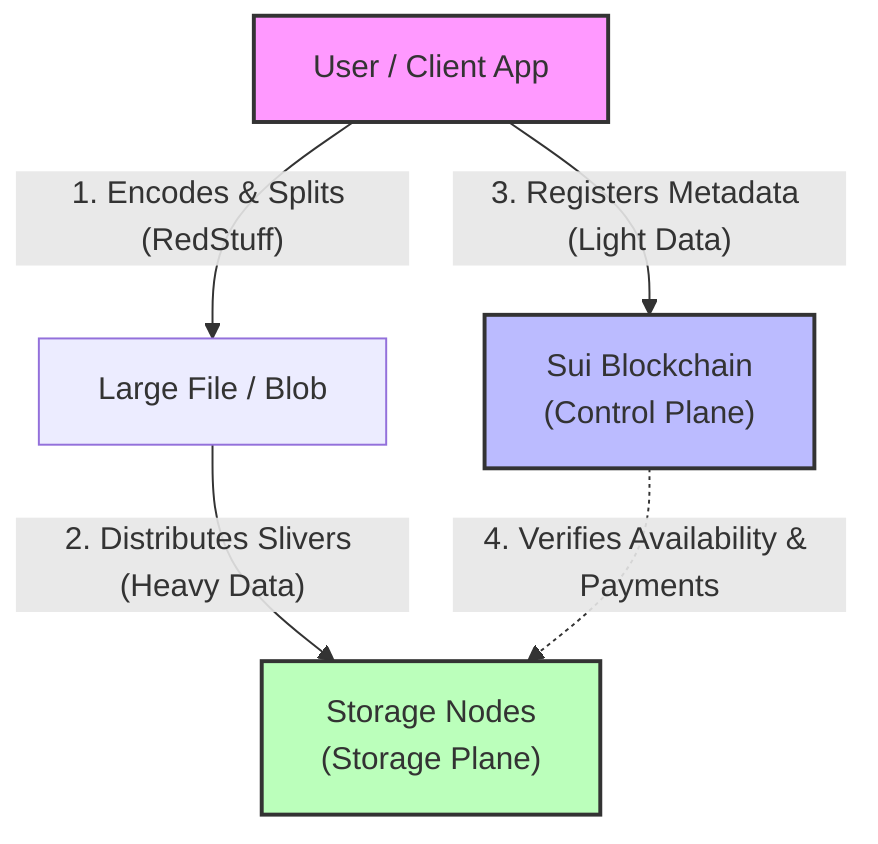

# Course Module 1: Introduction to Walrus

## 1. Learning Objectives

After completing this module, you will be able to:

* Understand why Walrus exists.

* Understand the basic problem Walrus solves.

* Understand the durability model of Walrus.

## 2. Content

### Purpose of Walrus

**Why does Walrus exist, and what problem does it solve?**

Walrus exists to solve the limitations of traditional data storage, especially for the "Web3" and decentralized web.

* **The Problem with Centralized Storage:** Traditional cloud storage (like Amazon S3 or Google Drive) is centralized. This creates single points of failure, exposes data to potential censorship or takedowns, and can be costly.

* **The Problem with Early Decentralized Storage:** Many first-generation decentralized storage networks solved the censorship issue but lacked the performance, cost-efficiency, and smart contract integration needed for complex applications.

**The Basic Problem Walrus Solves:**
Walrus provides a **performant, cost-effective, and programmable** decentralized storage layer specifically designed for **large, unstructured data files (known as "blobs")**.

Think of it as a decentralized storage solution built for the needs of modern applications, such as:

* NFT imagery and game assets

* AI/ML datasets and models

* Decentralized websites and applications

* Rich media content (videos, audio)

It addresses the need for storage that is not only decentralized but also "programmable" — meaning storage itself can be directly integrated with and controlled by smart contracts (specifically, on the Sui blockchain).

### Design Goals

Walrus was engineered with several key design goals in mind:

1. **Programmability:** This is a core concept. Storage on Walrus is not just a "dumb" bucket. Data and storage capacity are represented as "objects" on the Sui blockchain, making them a native resource that smart contracts can interact with.

2. **High Availability & Robustness:** The system is designed to ensure data remains available and intact even if many storage nodes fail or act maliciously (this is known as Byzantine Fault Tolerance).

3. **Cost Efficiency:** By using an advanced encoding method, Walrus provides high durability with a low "replication overhead." This means it doesn't need to store 10 copies of a file to keep it safe; it uses a more efficient method, "RedStuff," to achieve robustness with a much smaller storage footprint (around 4.5x replication).

4. **Scalability:** The protocol is built to scale to thousands of storage nodes without a drop in performance, using the Sui blockchain as its "control plane" for coordination.

5. **Ease of Use:** Walrus aims to be accessible to developers by providing familiar tools like a Command Line Interface (CLI), SDKs, and HTTP APIs, allowing it to integrate with traditional web technologies like CDNs.

### Durability Model and Retention Guarantees

This is how Walrus ensures your data is safe and "durable" (i.e., it doesn't get lost or corrupted).

* **Erasure Coding (RedStuff):** Instead of simply copying a file (replication), Walrus uses an advanced 2D erasure coding scheme called "RedStuff."

  * It takes a file (blob), splits it into many small pieces called "slivers."

  * It then creates "redundant" slivers using this encoding.

  * These slivers are distributed across a wide network of independent storage nodes.

* **Durability Guarantee:** The RedStuff encoding is so efficient that the original file can be completely rebuilt even if a large portion (e.g., two-thirds) of the data shards are lost or offline. This provides massive durability without the high storage cost of simple replication.

* **Proof-of-Availability (PoA):** Walrus doesn't just "hope" the nodes are storing the data.

  * The network "randomly challenges" storage nodes to prove they still hold the specific slivers they were assigned.

  * If a node fails this challenge, it is penalized, and its data is "healed" or re-replicated elsewhere on the network.

  * This system of continuous checks and automatic healing ensures data is retained and remains available.

### Storage and Retrieval in Simple Terms

**How do you store and get back a file?**

**1. Storing (Writing) a File:**

1. **Client Orchestrates:** As a user, your "client" (e.g., an app or your computer) coordinates the process.

2. **Split & Encode:** You upload your file (blob). The client, using RedStuff, splits the file into many small "slivers" and creates the redundant (parity) slivers.

3. **Distribute:** The client-distributes these hundreds or thousands of slivers across the decentralized network of storage nodes.

4. **Record:** The client then registers the blob's metadata (like a receipt or table of contents) as a smart contract "object" on the Sui blockchain. This object acts as the proof of ownership and the "map" to find the data.

**2. Retrieving (Reading) a File:**

1. **Request:** Your client initiates a request for the file using its unique "blob ID."

2. **Get Metadata:** The client first looks up the blob's metadata object on the Sui blockchain to get the "map."

3. **Fetch Slivers:** The client then fetches the required number of slivers from any of the storage nodes that hold them.

4. **Rebuild:** Because of the erasure coding, the client doesn't need to fetch *all* the slivers. It only needs to fetch *enough* of them to rebuild the complete file, even if some nodes are slow or offline.

### What Walrus Is Not

It is just as important to understand what Walrus is *not* designed to be:

* **It is not a traditional cloud provider.** It is a decentralized, peer-to-peer network.

* **It is not private by default.** All blobs stored on Walrus are public and accessible by anyone who has the blob ID. It is not suitable for storing confidential or private information without first encrypting it on the client-side (your end).

* **It is not a general-purpose database.** It is specifically optimized for storing and retrieving large, static, binary files (blobs), not for running complex queries like a SQL database.

* **It is not a simple file-sharing service.** While it can be used for that, its main power is its "programmability" as a foundational storage layer for decentralized applications.